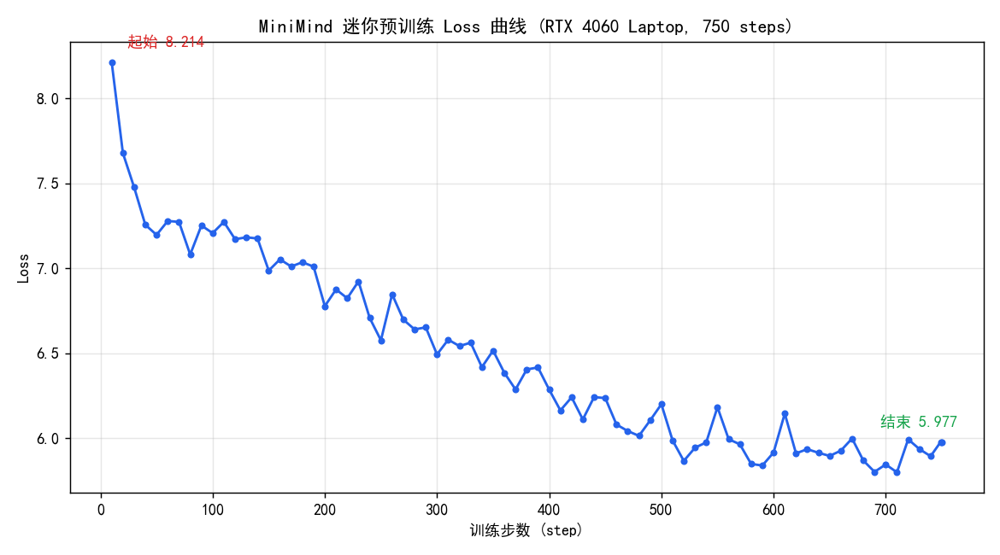

# 复现日志

> 本文件记录我复现 MiniMind 各阶段的**真实过程**：命令、超参、耗时、loss、遇到的问题与解决办法、以及最终产出。
> 这是整个项目最有价值的部分——它证明我不是 clone 了代码，而是真的跑通并理解了。

---

## 环境信息

| 项 | 值 |
|----|-----|
| 操作系统 | Windows 11 |
| GPU | NVIDIA GeForce RTX 4060 Laptop（8 GB 显存） |
| Python | 3.11 |
| PyTorch | 2.6.0+cu124 |
| CUDA | 驱动 566.24（支持 CUDA 12.7） |

> 详细依赖安装过程见 [环境搭建.md](环境搭建.md)。

---

## 阶段 0 · 训练分词器（可选）

- **目标**：从零训练 BPE 分词器，理解词表如何构建。
- **命令**：
  ```bash
  cd trainer && python train_tokenizer.py
  ```
- **状态**：🔲 待复现
- **记录**：
  - 耗时：
  - 词表大小：
  - 遇到的问题：
  - 结论 / 心得：

---

## 阶段 1 · 预训练 Pretrain（迷你验证跑）

> ⚠️ **诚实说明**：受限于 8GB 笔记本显卡，完整预训练（120 万条、单卡预计 4~8 小时）暂未跑完。
> 这里做的是**迷你验证跑**：取数据集前 12000 条，跑满 1 个 epoch（750 步），目的是**验证
> 从零训练流程完全跑通、且 loss 正常下降**。这是真实结果，不是完整训练成果。

- **目标**：验证预训练链路跑通，观察 loss 是否正常下降。
- **数据集**：`dataset/pretrain_t2t_mini.jsonl` 的前 12000 条（切成 `pretrain_demo.jsonl`）
- **命令**（实际执行）：
  ```bash
  cd trainer
  python train_pretrain.py \
    --data_path ../dataset/pretrain_demo.jsonl \
    --save_weight pretrain_demo \
    --batch_size 16 --accumulation_steps 4 --num_workers 0 \
    --log_interval 10 --save_interval 100000 --epochs 1
  ```
- **状态**：✅ 迷你验证跑完成（完整训练待后续）
- **记录**：
  - 超参说明：`batch_size` 从默认 32 降到 **16**（8GB 显存防爆），`accumulation_steps` 从 8 降到 4
    （等效 batch 16×4=64），其余用默认（hidden=512、8 层、lr=5e-4、bf16、max_seq_len=340）。
  - 单卡（RTX 4060 Laptop）。
  - 步数：750 步（1 epoch），日志共 76 个采样点。
  - **起始 loss 8.21 → 结束 loss 5.98**（清晰下降趋势）。
  - **Loss 曲线**：
  - **显存占用峰值：约 2.4 GB / 8 GB**（GPU 利用率 ~97%，配置稳妥无 OOM）。
  - 遇到的问题与解决：
    1. **数据集改名**：脚本默认 `pretrain_hq.jsonl` 已过时，ModelScope 现为 `pretrain_t2t_mini.jsonl`，
       需用 `--data_path` 指向真实文件（见下方「踩坑」）。
    2. venv 缺 `transformers` 等依赖 → 补装 `requirements.txt`（跳过 torch 以保 CUDA 版）。
  - 产出权重：`out/pretrain_demo_512.pth`（58MB，fp16，本人从零训练）。
  - 原始训练日志：[`results/pretrain_demo.log`](../results/pretrain_demo.log)
  - 结论 / 心得：从零初始化的模型 loss 从 ~8.2（约等于 ln(6400)≈8.76 的随机水平附近）稳定下降到
    ~6.0，说明模型确实在学习语言的统计规律，预训练链路验证通过。要得到能对话的模型，需在完整
    数据上训练更久（见阶段 2 及推理 demo）。

### 📌 踩坑：数据集文件改名
原项目脚本默认数据路径写的是 `pretrain_hq.jsonl` / `sft_mini_512.jsonl`，但 ModelScope 上的
`gongjy/minimind_dataset` 已更新为 `t2t` 命名：
| 脚本默认（旧） | 实际文件（现在） | 大小 |
|---|---|---|
| `pretrain_hq.jsonl` | `pretrain_t2t_mini.jsonl` | 1.2GB |
| `sft_mini_512.jsonl` | `sft_t2t_mini.jsonl` | 1.6GB |
数据格式不变（预训练 `{"text": ...}`，SFT `{"conversations": [...]}`），只需用 `--data_path` 指向新文件名即可。

---

## 推理验证 · 官方权重对话 Demo

> ⚠️ **诚实说明**：本节使用**原作者发布的 MiniMind2 权重**（HuggingFace 下载），
> 目的是验证本仓库的推理链路可用、并直观展示 MiniMind 模型的对话能力。
> **这不是本人训练的成果**（本人训练部分见上面阶段 1）。

- **权重**：`MiniMind2/`（Llama 架构，hidden=768，layers=16，vocab=6400，float16）
- **命令**：`python scripts/demo_chat.py`
- **状态**：✅ 完成
- **结果**：模型能连贯回答中文问题，生成速度约 **34~50 tokens/s**（RTX 4060 Laptop）。
  完整问答见 [`results/demo_chat_official_weights.md`](../results/demo_chat_official_weights.md)。
- **观察**：模型会自称"通义千问"，因为 MiniMind2 的 SFT 数据蒸馏自 Qwen；这是该权重的真实行为。
- **意义**：证明本仓库的 `model/` 结构定义、tokenizer、chat template、生成流程都能正确加载并运行一个完整训练好的 MiniMind 模型。

---

## 阶段 2 · 监督微调 SFT

- **目标**：让预训练模型学会「对话」格式，能回答问题。
- **数据集**：`dataset/sft_mini_512.jsonl`
- **命令**：
  ```bash
  cd trainer
  python train_full_sft.py \
    --data_path ../dataset/sft_mini_512.jsonl \
    --from_weight pretrain --epochs 2
  ```
- **状态**：🔲 待复现
- **记录**：
  - 实际超参：
  - 总耗时：
  - 起始 loss → 结束 loss：
  - Loss 曲线：
  - 产出权重：`out/full_sft_512.pth`
  - **对话样例**（贴几段 SFT 前后对比，最能体现效果）：
    ```
    用户：你好，请介绍一下你自己
    模型：
    ```
  - 结论 / 心得：

---

## 阶段 3 · LoRA 微调

- **目标**：理解参数高效微调，只训练少量参数。
- **状态**：🔲 待复现
- **记录**：
  - 命令：
  - 可训练参数量 vs 全参：
  - 效果对比：
  - 心得：

---

## 阶段 4 · 偏好优化 DPO

- **目标**：让模型输出更符合人类偏好。
- **状态**：🔲 待复现
- **记录**：
  - 命令：
  - 数据集：
  - 效果对比（DPO 前后同一 prompt 的回答）：
  - 心得：

---

## 阶段 5 · 知识蒸馏 / 推理蒸馏

- **状态**：🔲 待复现
- **记录**：

---

## 阶段 6 · 强化学习（PPO / GRPO / SPO）

- **状态**：🔲 待复现
- **记录**：

---

## 总结与反思

*（全部跑完后填写）*
- 我对 LLM 训练全流程的整体理解：
- 最难 / 最容易踩坑的阶段：
- 如果重来我会怎么做：
- 后续想尝试的改进方向：
