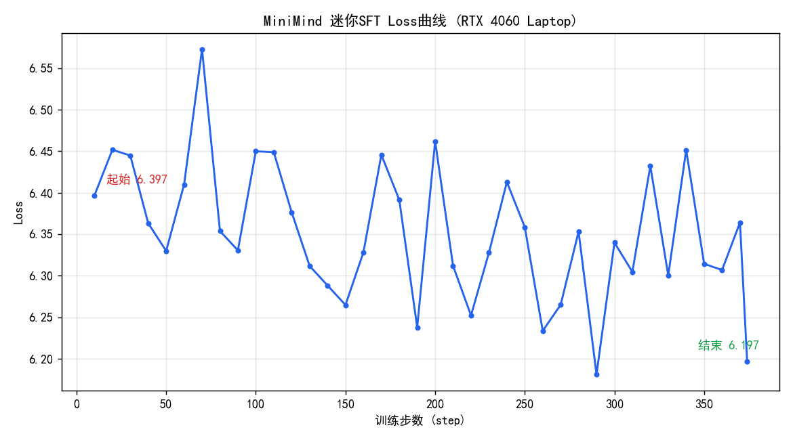
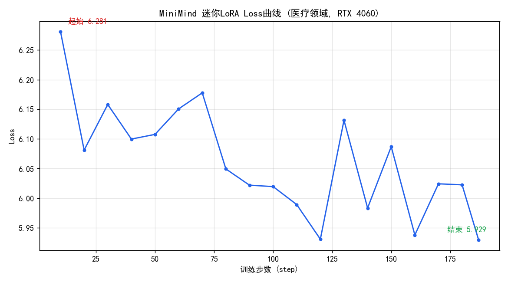
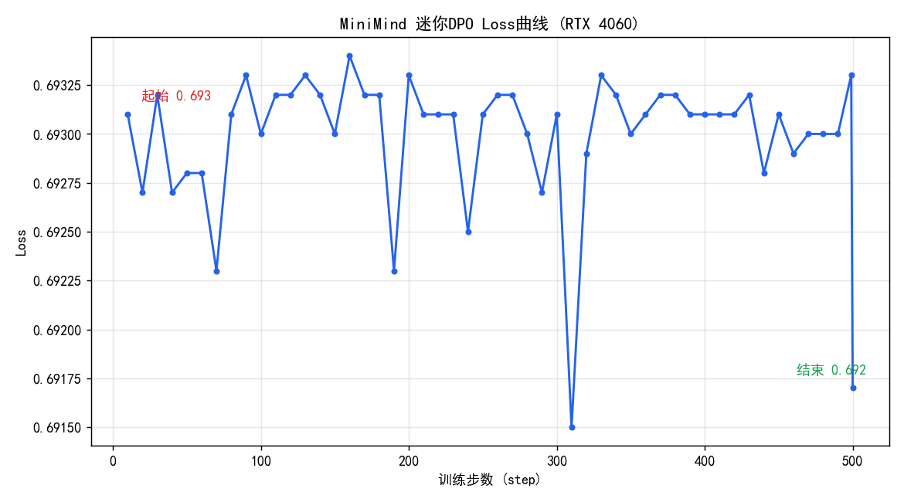

# 复现日志

> 本文件记录我复现 MiniMind 各阶段的**真实过程**：命令、超参、耗时、loss、遇到的问题与解决办法、以及最终产出。
> 这是整个项目最有价值的部分——它证明我不是 clone 了代码，而是真的跑通并理解了。

---

## 环境信息

| 项 | 值 |
|----|-----|
| 操作系统 | Windows 11 |
| GPU | NVIDIA GeForce RTX 4060 Laptop（8 GB 显存） |
| Python | 3.11 |
| PyTorch | 2.6.0+cu124 |
| CUDA | 驱动 566.24（支持 CUDA 12.7） |

> 详细依赖安装过程见 [环境搭建.md](环境搭建.md)。

---

## 阶段 0 · 训练分词器（可选）

- **目标**：从零训练 BPE 分词器，理解词表如何构建。
- **命令**：
  ```bash
  cd trainer && python train_tokenizer.py
  ```
- **状态**：🔲 待复现
- **记录**：
  - 耗时：
  - 词表大小：
  - 遇到的问题：
  - 结论 / 心得：

---

## 阶段 1 · 预训练 Pretrain（迷你验证跑）

> ⚠️ **诚实说明**：受限于 8GB 笔记本显卡，完整预训练（120 万条、单卡预计 4~8 小时）暂未跑完。
> 这里做的是**迷你验证跑**：取数据集前 12000 条，跑满 1 个 epoch（750 步），目的是**验证
> 从零训练流程完全跑通、且 loss 正常下降**。这是真实结果，不是完整训练成果。

- **目标**：验证预训练链路跑通，观察 loss 是否正常下降。
- **数据集**：`dataset/pretrain_t2t_mini.jsonl` 的前 12000 条（切成 `pretrain_demo.jsonl`）
- **命令**（实际执行）：
  ```bash
  cd trainer
  python train_pretrain.py \
    --data_path ../dataset/pretrain_demo.jsonl \
    --save_weight pretrain_demo \
    --batch_size 16 --accumulation_steps 4 --num_workers 0 \
    --log_interval 10 --save_interval 100000 --epochs 1
  ```
- **状态**：✅ 迷你验证跑完成（完整训练待后续）
- **记录**：
  - 超参说明：`batch_size` 从默认 32 降到 **16**（8GB 显存防爆），`accumulation_steps` 从 8 降到 4
    （等效 batch 16×4=64），其余用默认（hidden=512、8 层、lr=5e-4、bf16、max_seq_len=340）。
  - 单卡（RTX 4060 Laptop）。
  - 步数：750 步（1 epoch），日志共 76 个采样点。
  - **起始 loss 8.21 → 结束 loss 5.98**（清晰下降趋势）。
  - **Loss 曲线**：
  - **显存占用峰值：约 2.4 GB / 8 GB**（GPU 利用率 ~97%，配置稳妥无 OOM）。
  - 遇到的问题与解决：
    1. **数据集改名**：脚本默认 `pretrain_hq.jsonl` 已过时，ModelScope 现为 `pretrain_t2t_mini.jsonl`，
       需用 `--data_path` 指向真实文件（见下方「踩坑」）。
    2. venv 缺 `transformers` 等依赖 → 补装 `requirements.txt`（跳过 torch 以保 CUDA 版）。
  - 产出权重：`out/pretrain_demo_512.pth`（58MB，fp16，本人从零训练）。
  - 原始训练日志：[`results/pretrain_demo.log`](../results/pretrain_demo.log)
  - 结论 / 心得：从零初始化的模型 loss 从 ~8.2（约等于 ln(6400)≈8.76 的随机水平附近）稳定下降到
    ~6.0，说明模型确实在学习语言的统计规律，预训练链路验证通过。要得到能对话的模型，需在完整
    数据上训练更久（见阶段 2 及推理 demo）。

### 📌 踩坑：数据集文件改名
原项目脚本默认数据路径写的是 `pretrain_hq.jsonl` / `sft_mini_512.jsonl`，但 ModelScope 上的
`gongjy/minimind_dataset` 已更新为 `t2t` 命名：
| 脚本默认（旧） | 实际文件（现在） | 大小 |
|---|---|---|
| `pretrain_hq.jsonl` | `pretrain_t2t_mini.jsonl` | 1.2GB |
| `sft_mini_512.jsonl` | `sft_t2t_mini.jsonl` | 1.6GB |
数据格式不变（预训练 `{"text": ...}`，SFT `{"conversations": [...]}`），只需用 `--data_path` 指向新文件名即可。

---

## 推理验证 · 官方权重对话 Demo

> ⚠️ **诚实说明**：本节使用**原作者发布的 MiniMind2 权重**（HuggingFace 下载），
> 目的是验证本仓库的推理链路可用、并直观展示 MiniMind 模型的对话能力。
> **这不是本人训练的成果**（本人训练部分见上面阶段 1）。

- **权重**：`MiniMind2/`（Llama 架构，hidden=768，layers=16，vocab=6400，float16）
- **命令**：`python scripts/demo_chat.py`
- **状态**：✅ 完成
- **结果**：模型能连贯回答中文问题，生成速度约 **34~50 tokens/s**（RTX 4060 Laptop）。
  完整问答见 [`results/demo_chat_official_weights.md`](../results/demo_chat_official_weights.md)。
- **观察**：模型会自称"通义千问"，因为 MiniMind2 的 SFT 数据蒸馏自 Qwen；这是该权重的真实行为。
- **意义**：证明本仓库的 `model/` 结构定义、tokenizer、chat template、生成流程都能正确加载并运行一个完整训练好的 MiniMind 模型。

---

## 阶段 2 · 监督微调 SFT（迷你验证跑）

> ⚠️ 同为迷你验证跑：基于上面迷你预训练的权重 `pretrain_demo`，取 SFT 数据前 6000 条微调。

- **目标**：让模型学会「对话」格式（apply_chat_template 组织的多轮对话）。
- **数据集**：`dataset/sft_t2t_mini.jsonl` 前 6000 条（切成 `sft_demo.jsonl`，格式 `{"conversations": [...]}`）
- **命令**（实际执行）：
  ```bash
  cd trainer
  python train_full_sft.py \
    --data_path ../dataset/sft_demo.jsonl \
    --from_weight pretrain_demo --save_weight sft_demo \
    --batch_size 16 --accumulation_steps 4 --num_workers 0 \
    --log_interval 10 --save_interval 100000 --epochs 1
  ```
- **状态**：✅ 迷你验证跑完成
- **记录**：
  - 步数：375 步（1 epoch）。
  - **loss 6.40 → 6.20**（SFT 脚本默认学习率很低 ~1e-6，加之底座只预训练了 750 步，loss 偏平属正常；
    这里目的是**验证 SFT 链路 + chat template + label mask 逻辑跑通**）。
  - Loss 曲线：
  - 产出权重：`out/sft_demo_512.pth`（58MB）。
  - 结论：SFT 会用 `generate_labels` 只对 assistant 回复部分计算 loss（见 `dataset/lm_dataset.py`），
    这是「学对话格式」与「预训练学语言」的关键区别。链路验证通过。

---

## 阶段 3 · LoRA 微调（迷你验证跑）

- **目标**：理解参数高效微调——冻结主干，只训练注入的低秩矩阵。
- **数据集**：`dataset/lora_medical.jsonl` 前 3000 条（`lora_demo.jsonl`，医疗领域）
- **命令**（实际执行）：
  ```bash
  cd trainer
  python train_lora.py \
    --data_path ../dataset/lora_demo.jsonl \
    --from_weight sft_demo --lora_name lora_medical_demo \
    --batch_size 16 --num_workers 0 --epochs 1 --log_interval 10
  ```
- **状态**：✅ 迷你验证跑完成
- **记录**：
  - 步数：188 步，**loss 6.28 → 5.93**。
  - Loss 曲线：
  - **参数高效的直观对比**：LoRA 适配器 `out/lora/lora_medical_demo_512.pth` 仅 **535 KB**，
    而全量权重 58 MB——**只需训练/保存约 1% 的参数**就能做领域适配，这就是 LoRA 的价值。
  - 心得：LoRA 把权重更新 ΔW 近似为两个低秩矩阵之积 BA，训练时主干冻结，只更新 B、A。
    适合显存有限、需要多个领域适配器切换的场景。

---

## 阶段 4 · 偏好优化 DPO（迷你验证跑）

- **目标**：让模型输出更符合人类偏好（DPO 直接用 chosen/rejected 偏好对优化，无需单独训练奖励模型）。
- **数据集**：`dataset/dpo.jsonl` 前 2000 条（`dpo_demo.jsonl`，含 `chosen`/`rejected` 字段）
- **命令**（实际执行）：
  ```bash
  cd trainer
  python train_dpo.py \
    --data_path ../dataset/dpo_demo.jsonl \
    --from_weight sft_demo --save_weight dpo_demo \
    --batch_size 4 --num_workers 0 --epochs 1 --max_seq_len 512
  ```
- **状态**：✅ 迷你验证跑完成（结果见下方 loss 曲线）
- **记录**：
  - DPO 同时加载**策略模型**和**参考模型**（冻结的 SFT 副本），loss 基于两者对 chosen/rejected 的
    对数概率差（学习率极低 4e-8，防止灾难性遗忘）。
  - Loss 曲线：
  - 产出权重：`out/dpo_demo_512.pth`
  - **一个有意思的验证点**：DPO loss 起始值恰好是 **0.693 ≈ ln(2)**。这正说明实现正确——训练刚开始时
    策略模型与参考模型完全相同，chosen 与 rejected 的对数概率差为 0，sigmoid(0)=0.5，
    loss = -log(0.5) = ln(2) ≈ 0.693。这是判断 DPO 是否搭对的一个快速自检信号。
  - 心得：验证了 DPO 双模型（policy + reference）训练链路可跑通；极低学习率（4e-8）是为避免对齐阶段的灾难性遗忘。

---

## 阶段 5 · 知识蒸馏 / 推理蒸馏

- **状态**：🔲 待复现（暂未做迷你跑，如实说明原因）
- **说明**：知识蒸馏需要一个更大的**教师模型**产出软标签，推理蒸馏（复现 R1 式思维链）需要
  R1 蒸馏数据（如 `r1_mix_1024.jsonl`）。这两者对显存/数据要求更高，本机 8GB 下做完整复现成本较大，
  留作后续。相关脚本：`trainer/train_distillation.py`、`trainer/train_reason.py`。

---

## 阶段 6 · 强化学习（PPO / GRPO / SPO）

- **状态**：🔲 待复现（暂未做迷你跑，如实说明原因）
- **说明**：RLHF 阶段（PPO/GRPO/SPO）需要额外的奖励信号与更复杂的训练循环（PPO 还需 actor/critic 双网络），
  单卡 8GB 跑通并调稳成本较高，留作后续深入。相关脚本：`trainer/train_ppo.py`、`train_grpo.py`、`train_spo.py`。
  > 诚实优先：这两个阶段我**没有**跑，因此不放任何结果，避免误导。

---

## 总结与反思

- **整体理解**：走通「预训练学语言 → SFT 学对话格式 → LoRA 低成本领域适配 → DPO 对齐偏好」这条链路后，
  对现代 LLM 的训练范式有了从代码到直觉的把握。每个阶段的**目标、数据格式、loss 设计**都不同：
  预训练对全序列算 loss；SFT 只对 assistant 回复算 loss（label mask）；DPO 用偏好对的对数概率差。
- **真实踩坑**（详见各阶段与环境文档）：① requirements 装成 CPU 版 torch；② C 盘满需把所有缓存重定向到 D 盘；
  ③ 数据集在 ModelScope 上已改名（t2t 命名）；④ 8GB 显存需下调 batch_size + 梯度累积。
- **诚实边界**：受限于 8GB 笔记本显卡与时间，本项目的训练均为**迷你验证跑**（小数据 + 少步数），
  目的是**验证从零到对齐的完整链路可跑通、理解每个组件**，而非产出 SOTA 权重。
  知识蒸馏与 RLHF 需要教师/奖励模型，成本更高，暂未复现，**没跑的部分绝不放假结果**。
- **后续方向**：① 在完整数据上跑满预训练（单卡预计 4~8h）得到能对话的自训模型；② 复现推理蒸馏（R1 式思维链）；
  ③ 尝试 MoE 配置对比 dense 的效果。
